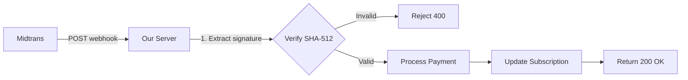
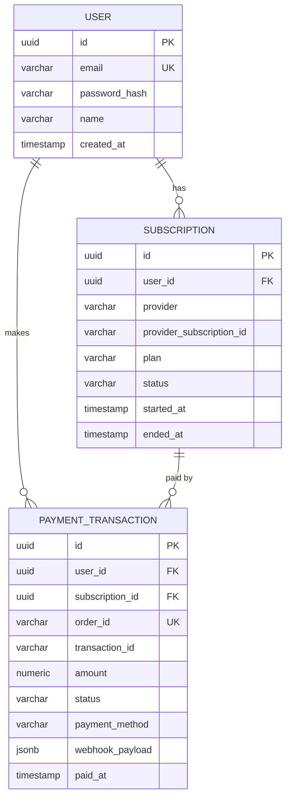
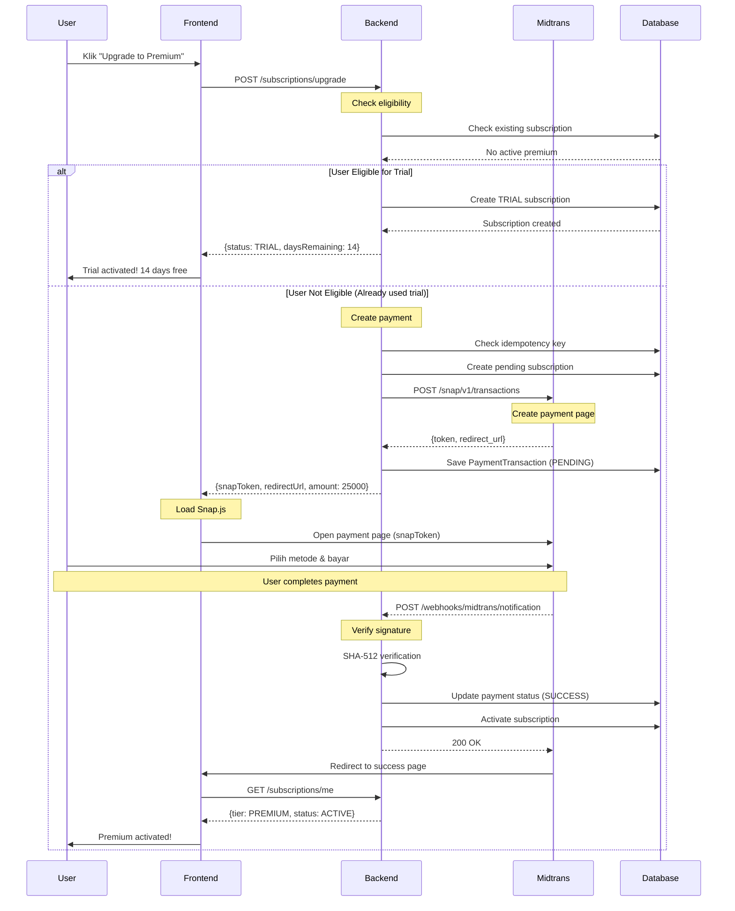
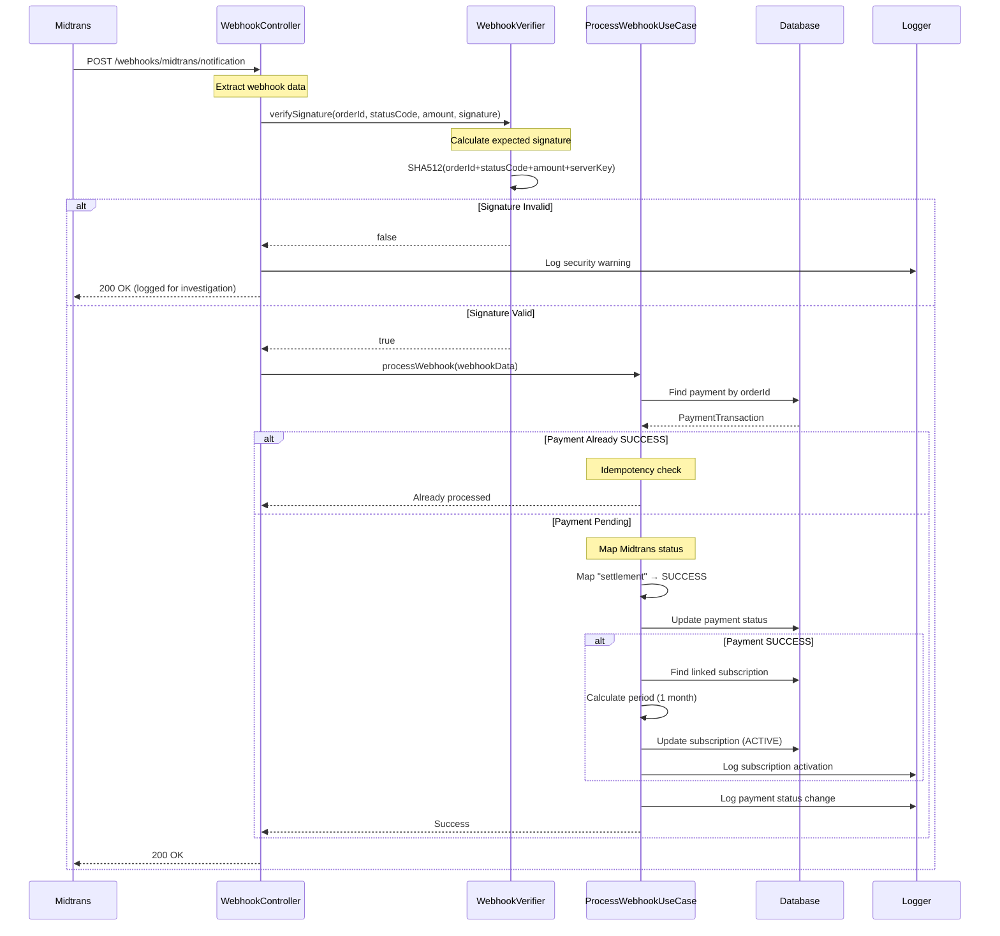
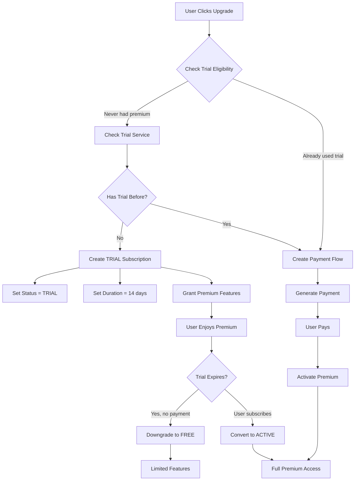
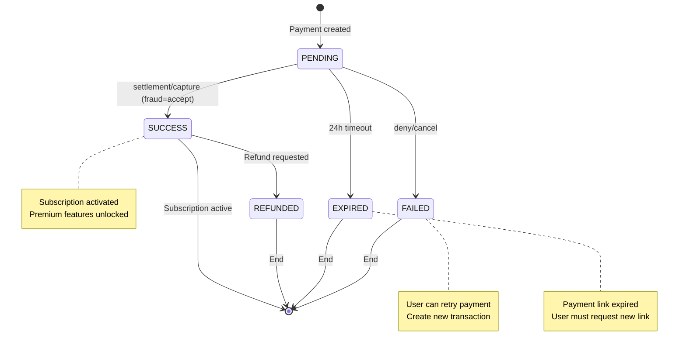

# Milestone 5: Integrasi Payment Gateway Midtrans

## Daftar Isi

1. [Overview](#1-overview)
2. [Arsitektur & Design Decisions](#2-arsitektur--design-decisions)
3. [Database Schema & Migration](#3-database-schema--migration)
4. [Flow Diagram](#4-flow-diagram)
5. [Implementasi Detail](#5-implementasi-detail)
6. [API Documentation](#6-api-documentation)
7. [Konfigurasi](#7-konfigurasi)
8. [Testing Guide](#8-testing-guide)
9. [Deployment Checklist](#9-deployment-checklist)
10. [Frontend Integration](#10-frontend-integration)
11. [Troubleshooting](#11-troubleshooting)

---

## 1. Overview

### 1.1 Tujuan

Mengintegrasikan Midtrans payment gateway untuk mengelola subscription premium dengan fitur:
- **Premium Subscription**: IDR 25,000/bulan
- **Trial Period**: 14 hari gratis untuk user baru
- **Multiple Payment Methods**: Credit Card, GoPay, QRIS, Bank Transfer, Virtual Account
- **Automatic Activation**: Subscription otomatis aktif setelah pembayaran berhasil
- **Security**: Webhook signature verification dengan SHA-512

### 1.2 Fitur Utama

#### Free Tier
- 1 wallet
- Limited categories (10 categories)
- Export CSV (max 100 records)
- Date range limit: 90 hari
- Basic reports

#### Premium Tier (IDR 25,000/bulan)
- Unlimited wallets
- Unlimited categories
- Export Excel & PDF (max 10,000 records)
- Date range limit: 365 hari
- Advanced reports dengan trend analysis
- Cloud backup
- Priority support

#### Trial Period
- 14 hari gratis untuk user baru
- Akses penuh ke semua fitur premium
- Tidak perlu kartu kredit untuk mulai trial
- Setelah trial berakhir, otomatis kembali ke Free tier jika tidak subscribe

---

## 2. Arsitektur & Design Decisions

### 2.1 Payment Gateway: Midtrans Snap API

**Mengapa Snap API?**

| Kriteria | Snap API | Core API |
|----------|----------|----------|
| **Ease of Integration** | ✅ Sangat mudah (1 API call) | ❌ Complex (multiple steps) |
| **Payment UI** | ✅ Disediakan Midtrans | ❌ Harus build sendiri |
| **Payment Methods** | ✅ All methods automatic | ⚠️ Must configure each |
| **Mobile Optimization** | ✅ Responsive by default | ❌ Manual implementation |
| **PCI DSS Compliance** | ✅ Handled by Midtrans | ⚠️ Additional compliance needed |
| **Maintenance** | ✅ Midtrans updates UI | ❌ We handle updates |

**Kesimpulan**: Snap API lebih cocok untuk UMKM karena:
- Faster time to market
- Lower maintenance cost
- Built-in security & compliance
- Support semua metode pembayaran Indonesia

### 2.2 Clean Architecture Pattern

Aplikasi ini mengikuti Clean Architecture dengan separation of concerns yang jelas:

```
┌─────────────────────────────────────────────────┐
│         Presentation Layer                      │
│  (Controllers, DTOs, Request/Response)          │
└────────────────┬────────────────────────────────┘
                 │
┌────────────────▼────────────────────────────────┐
│         Use Case Layer                          │
│  (Business Logic, Orchestration)                │
└────────────────┬────────────────────────────────┘
                 │
┌────────────────▼────────────────────────────────┐
│         Domain Layer                            │
│  (Entities, Repository Interfaces)              │
└────────────────┬────────────────────────────────┘
                 │
┌────────────────▼────────────────────────────────┐
│         Infrastructure Layer                    │
│  (Database, External APIs, Configuration)       │
└─────────────────────────────────────────────────┘
```

**Keuntungan**:
- **Testability**: Setiap layer bisa ditest independen
- **Maintainability**: Perubahan di satu layer tidak affect layer lain
- **Scalability**: Mudah menambah fitur baru
- **Independence**: Business logic tidak depend on framework

### 2.3 Security Strategy

#### Webhook Security


**Signature Verification**:
```
signature = SHA512(order_id + status_code + gross_amount + server_key)
```

#### Idempotency
- **Payment Creation**: Menggunakan idempotency_key untuk prevent duplicate payment
- **Webhook Processing**: Check payment status sebelum update untuk prevent duplicate processing

#### Data Protection
- **Secrets**: Semua API keys disimpan di environment variables, tidak di code
- **Audit Trail**: Full webhook payload disimpan dalam JSONB untuk forensic analysis
- **Transaction Logging**: Semua business events di-log dengan correlation ID

---

## 3. Database Schema & Migration

### 3.1 New Table: payment_transactions

```sql
CREATE TABLE payment_transactions (
    -- Primary Key
    id UUID PRIMARY KEY,

    -- Relationships
    user_id UUID NOT NULL REFERENCES users(id),
    subscription_id UUID REFERENCES subscriptions(id),

    -- Midtrans Identifiers
    order_id VARCHAR(255) UNIQUE NOT NULL,
    transaction_id VARCHAR(255),

    -- Payment Details
    amount NUMERIC(15, 2) NOT NULL,
    currency VARCHAR(3) DEFAULT 'IDR',
    payment_method VARCHAR(50),

    -- Status Tracking
    status VARCHAR(20) NOT NULL,
    provider VARCHAR(20) NOT NULL,

    -- Midtrans Response Data
    snap_token TEXT,
    snap_redirect_url TEXT,
    webhook_payload JSONB,

    -- Security & Metadata
    idempotency_key VARCHAR(255) UNIQUE,
    metadata JSONB,

    -- Timestamps
    paid_at TIMESTAMP,
    expired_at TIMESTAMP,
    created_at TIMESTAMP NOT NULL DEFAULT NOW(),
    updated_at TIMESTAMP NOT NULL DEFAULT NOW(),

    -- Indexes for Performance
    INDEX idx_payment_user (user_id),
    INDEX idx_payment_order (order_id),
    INDEX idx_payment_status (status),
    INDEX idx_payment_created (created_at DESC)
);
```

### 3.2 Update Existing: subscriptions

Tabel subscriptions sudah ada, hanya perlu menambahkan indexes:

```sql
-- Add indexes for better query performance
CREATE INDEX IF NOT EXISTS idx_subscription_user ON subscriptions(user_id);
CREATE INDEX IF NOT EXISTS idx_subscription_status ON subscriptions(status);
CREATE INDEX IF NOT EXISTS idx_subscription_ended ON subscriptions(ended_at);
```

### 3.3 Migration File

**File**: `src/main/resources/db/migration/V4__add_payment_tables.sql`

Lengkap dengan rollback comments untuk emergency situations.

### 3.4 Entity Relationship Diagram



---

## 4. Flow Diagram

### 4.1 Upgrade to Premium Flow



### 4.2 Webhook Processing Flow



### 4.3 Trial Period Flow



### 4.4 Payment Status State Machine



---

## 5. Implementasi Detail

### 5.1 Package Structure

```
src/main/java/com/fajars/expensetracker/
│
├── payment/
│   ├── PaymentTransaction.java                    (Entity)
│   ├── PaymentTransactionRepository.java          (JPA Repository)
│   ├── PaymentStatus.java                         (Enum)
│   ├── PaymentMethod.java                         (Enum)
│   ├── PaymentProvider.java                       (Enum)
│   ├── PaymentResponse.java                       (Record DTO)
│   ├── PaymentWebhookRequest.java                 (Record DTO)
│   ├── PaymentWebhookController.java              (REST Controller)
│   │
│   ├── usecase/
│   │   ├── CreateSubscriptionPayment.java         (Interface)
│   │   ├── CreateSubscriptionPaymentUseCase.java  (Implementation)
│   │   ├── ProcessPaymentWebhook.java             (Interface)
│   │   └── ProcessPaymentWebhookUseCase.java      (Implementation)
│   │
│   └── midtrans/
│       ├── MidtransClient.java                    (External API Client)
│       ├── MidtransConfig.java                    (Configuration)
│       ├── WebhookVerifier.java                   (Security)
│       ├── MidtransSnapResponse.java              (Record)
│       ├── MidtransStatusResponse.java            (Record)
│       └── MidtransException.java                 (Custom Exception)
│
├── subscription/
│   ├── Subscription.java                          (Entity - existing)
│   ├── SubscriptionRepository.java                (JPA Repository - NEW)
│   ├── SubscriptionService.java                   (Service - update)
│   ├── SubscriptionTier.java                      (Enum - existing)
│   ├── SubscriptionStatus.java                    (Enum - NEW)
│   ├── SubscriptionController.java                (REST Controller - NEW)
│   ├── SubscriptionResponse.java                  (Record DTO - NEW)
│   ├── CreateSubscriptionRequest.java             (Record DTO - NEW)
│   │
│   └── usecase/
│       ├── GetUserSubscription.java               (Interface)
│       ├── GetUserSubscriptionUseCase.java        (Implementation)
│       ├── CheckTrialEligibility.java             (Interface)
│       └── CheckTrialEligibilityUseCase.java      (Implementation)
```

### 5.2 Core Enums

#### PaymentStatus
```java
public enum PaymentStatus {
    PENDING,      // Menunggu pembayaran user
    SUCCESS,      // Pembayaran berhasil
    FAILED,       // Pembayaran gagal (ditolak/dibatalkan)
    EXPIRED,      // Link pembayaran expired (24 jam)
    CANCELLED,    // User membatalkan
    REFUNDED      // Pembayaran di-refund (future feature)
}
```

#### SubscriptionStatus
```java
public enum SubscriptionStatus {
    ACTIVE,       // Subscription aktif (berbayar)
    TRIAL,        // Trial period 14 hari
    EXPIRED,      // Subscription habis masa berlaku
    CANCELLED,    // User membatalkan subscription
    PENDING       // Menunggu pembayaran
}
```

#### PaymentMethod
```java
public enum PaymentMethod {
    CREDIT_CARD,   // Kartu kredit
    DEBIT_CARD,    // Kartu debit
    GOPAY,         // GoPay
    QRIS,          // QRIS (Scan QR)
    BCA_VA,        // Virtual Account BCA
    BNI_VA,        // Virtual Account BNI
    BRI_VA,        // Virtual Account BRI
    MANDIRI_VA,    // Virtual Account Mandiri
    PERMATA_VA,    // Virtual Account Permata
    CIMB_VA,       // Virtual Account CIMB
    INDOMARET,     // Bayar di Indomaret
    ALFAMART       // Bayar di Alfamart
}
```

### 5.3 Key Classes

#### MidtransClient

**Responsibility**: Komunikasi dengan Midtrans API

**Key Methods**:
- `createSnapTransaction()` - Buat payment page
- `getTransactionStatus()` - Cek status pembayaran

**Error Handling**:
- Timeout: 30 detik untuk Snap API, 15 detik untuk status check
- Retry: Tidak ada automatic retry (user harus retry manual)
- Logging: Semua API calls di-log dengan request/response

#### WebhookVerifier

**Responsibility**: Security verification untuk webhook

**Signature Algorithm**:
```java
String input = orderId + statusCode + grossAmount + serverKey;
String signature = SHA512(input);
```

**Security Measures**:
- Constant-time comparison untuk prevent timing attacks
- Log semua invalid signatures untuk security monitoring
- Return false jika SHA-512 algorithm tidak tersedia

#### CreateSubscriptionPaymentUseCase

**Business Logic**:
1. Validate user exists
2. Check trial eligibility
3. If eligible → create TRIAL subscription (no payment)
4. If not → create payment transaction
5. Call Midtrans Snap API
6. Save payment record
7. Return payment response

**Validations**:
- User tidak boleh sudah punya active premium subscription
- Amount harus > 0
- Idempotency key harus unique (jika provided)

**Pricing Logic**:
```java
BigDecimal basePrice = new BigDecimal("25000"); // IDR per month
BigDecimal totalAmount = basePrice.multiply(new BigDecimal(durationMonths));
```

#### ProcessPaymentWebhookUseCase

**Business Logic**:
1. Verify webhook signature
2. Find payment by orderId
3. Check idempotency (already processed?)
4. Map Midtrans status to our PaymentStatus
5. Update payment record
6. If SUCCESS → activate subscription
7. Log business event

**Midtrans Status Mapping**:
```java
switch (midtransStatus) {
    case "settlement" -> PaymentStatus.SUCCESS;
    case "capture" -> fraudStatus.equals("accept") ? SUCCESS : FAILED;
    case "pending" -> PaymentStatus.PENDING;
    case "deny", "cancel" -> PaymentStatus.FAILED;
    case "expire" -> PaymentStatus.EXPIRED;
    case "refund", "partial_refund" -> PaymentStatus.REFUNDED;
}
```

**Subscription Activation**:
```java
// Calculate subscription period
Calendar cal = Calendar.getInstance();
Date startDate = cal.getTime();
cal.add(Calendar.MONTH, durationMonths); // Add months
Date endDate = cal.getTime();

subscription.setStatus("ACTIVE");
subscription.setStartedAt(startDate);
subscription.setEndedAt(endDate);
subscription.setProviderSubscriptionId(transactionId);
```

---

## 6. API Documentation

### 6.1 POST /api/v1/subscriptions/upgrade

**Description**: Upgrade user subscription to premium tier

**Authentication**: Required (JWT Bearer Token)

**Request Headers**:
```
Authorization: Bearer <jwt-token>
Content-Type: application/json
```

**Request Body**:
```json
{
  "tier": "PREMIUM",
  "durationMonths": 1,
  "idempotencyKey": "upgrade-20241206-user123" // Optional
}
```

**Request Fields**:
| Field | Type | Required | Description |
|-------|------|----------|-------------|
| tier | String (Enum) | Yes | Target tier: "PREMIUM" |
| durationMonths | Integer | No | Duration (default: 1) |
| idempotencyKey | String | No | Untuk prevent duplicate payment |

**Response Success (200 OK)** - Trial Eligible:
```json
{
  "status": "TRIAL",
  "tier": "PREMIUM",
  "startedAt": "2024-12-06T10:00:00",
  "endedAt": "2024-12-20T10:00:00",
  "daysRemaining": 14,
  "message": "Trial period activated! Enjoy 14 days of premium features."
}
```

**Response Success (200 OK)** - Payment Required:
```json
{
  "paymentId": "550e8400-e29b-41d4-a716-446655440000",
  "orderId": "EXP-1733453862123-abc12345",
  "amount": 25000,
  "currency": "IDR",
  "status": "PENDING",
  "snapToken": "66e4fa55-fdac-4ef9-91b5-733b97d1b862",
  "redirectUrl": "https://app.sandbox.midtrans.com/snap/v2/vtweb/66e4fa55...",
  "expiresAt": "2024-12-07T10:00:00Z"
}
```

**Error Responses**:

**409 Conflict** - Already has active premium:
```json
{
  "status": 409,
  "error": "Conflict",
  "message": "User already has an active premium subscription",
  "timestamp": "2024-12-06T10:00:00",
  "path": "/api/v1/subscriptions/upgrade"
}
```

**422 Unprocessable Entity** - Midtrans API error:
```json
{
  "status": 422,
  "error": "Unprocessable Entity",
  "message": "Failed to create payment. Please try again later.",
  "timestamp": "2024-12-06T10:00:00",
  "path": "/api/v1/subscriptions/upgrade"
}
```

---

### 6.2 GET /api/v1/subscriptions/me

**Description**: Get current user's subscription information

**Authentication**: Required (JWT Bearer Token)

**Request Headers**:
```
Authorization: Bearer <jwt-token>
```

**Response Success (200 OK)** - Premium User:
```json
{
  "id": "550e8400-e29b-41d4-a716-446655440000",
  "tier": "PREMIUM",
  "status": "ACTIVE",
  "startedAt": "2024-12-01T00:00:00",
  "endedAt": "2025-01-01T00:00:00",
  "daysRemaining": 25
}
```

**Response Success (200 OK)** - Trial User:
```json
{
  "id": "550e8400-e29b-41d4-a716-446655440001",
  "tier": "PREMIUM",
  "status": "TRIAL",
  "startedAt": "2024-12-06T10:00:00",
  "endedAt": "2024-12-20T10:00:00",
  "daysRemaining": 14
}
```

**Response Success (200 OK)** - Free User:
```json
{
  "id": null,
  "tier": "FREE",
  "status": null,
  "startedAt": null,
  "endedAt": null,
  "daysRemaining": null
}
```

---

### 6.3 POST /api/v1/webhooks/midtrans/notification

**Description**: Webhook endpoint for receiving Midtrans payment notifications

**Authentication**: None (Public endpoint, secured by signature verification)

⚠️ **IMPORTANT**: Endpoint ini harus publicly accessible (tidak ada JWT authentication). Security dijamin oleh SHA-512 signature verification.

**Request Headers** (from Midtrans):
```
Content-Type: application/json
```

**Request Body** (from Midtrans):
```json
{
  "order_id": "EXP-1733453862123-abc12345",
  "status_code": "200",
  "gross_amount": "25000.00",
  "signature_key": "abc123def456...",
  "transaction_status": "settlement",
  "transaction_id": "550e8400-e29b-41d4-a716-446655440000",
  "transaction_time": "2024-12-06 10:30:00",
  "payment_type": "gopay",
  "fraud_status": "accept"
}
```

**Response Success (200 OK)**:
```json
{
  "status": "success",
  "message": "Notification processed"
}
```

**Response Error (200 OK)** - Invalid Signature:
```json
{
  "status": "error",
  "message": "Error logged for investigation"
}
```

⚠️ **Note**: Kita tetap return 200 OK meskipun ada error, untuk prevent Midtrans dari retry. Error di-log untuk manual investigation.

---

### 6.4 Error Handling

#### Global Error Response Format
```json
{
  "status": 400,
  "error": "Bad Request",
  "message": "Detailed error message",
  "timestamp": "2024-12-06T10:00:00",
  "path": "/api/v1/subscriptions/upgrade",
  "correlationId": "abc-123-def-456"
}
```

#### Common HTTP Status Codes

| Code | Error Type | When It Happens |
|------|-----------|-----------------|
| 400 | Bad Request | Invalid request body, validation error |
| 401 | Unauthorized | Missing or invalid JWT token |
| 403 | Forbidden | User tidak punya akses ke resource |
| 404 | Not Found | Resource tidak ditemukan |
| 409 | Conflict | Duplicate resource (e.g., already premium) |
| 422 | Unprocessable Entity | Business logic error (e.g., Midtrans API fail) |
| 429 | Too Many Requests | Rate limit exceeded |
| 500 | Internal Server Error | Unexpected server error |

---

## 7. Konfigurasi

### 7.1 Environment Variables

**File**: `.env` (jangan commit ke Git!)

```bash
# Midtrans Configuration
MIDTRANS_SERVER_KEY=SB-Mid-server-YOUR_SERVER_KEY_HERE
MIDTRANS_CLIENT_KEY=SB-Mid-client-YOUR_CLIENT_KEY_HERE
MIDTRANS_API_URL=https://api.sandbox.midtrans.com
MIDTRANS_IS_PRODUCTION=false

# Application
SPRING_PROFILES_ACTIVE=dev

# Database
SPRING_DATASOURCE_URL=jdbc:postgresql://localhost:5432/expense_tracker?timezone=Asia/Jakarta
SPRING_DATASOURCE_USERNAME=expenseuser
SPRING_DATASOURCE_PASSWORD=expensepass

# JWT
JWT_SECRET=your-super-secret-key-min-256-bits-change-this-in-production

# Webhook URL (for Midtrans dashboard configuration)
WEBHOOK_URL=http://localhost:8081/api/v1/webhooks/midtrans/notification
```

### 7.2 Application Configuration

**File**: `src/main/resources/application.yaml`

```yaml
# Midtrans Configuration
midtrans:
  server-key: ${MIDTRANS_SERVER_KEY}
  client-key: ${MIDTRANS_CLIENT_KEY}
  api-url: ${MIDTRANS_API_URL:https://api.sandbox.midtrans.com}
  is-production: ${MIDTRANS_IS_PRODUCTION:false}
  transaction-expiry-minutes: 1440  # 24 hours

# Subscription Configuration
subscription:
  premium:
    monthly-price: 25000  # IDR
    trial-days: 14

# Spring Boot Configuration
spring:
  application:
    name: expense-tracker
  datasource:
    url: ${SPRING_DATASOURCE_URL}
    username: ${SPRING_DATASOURCE_USERNAME}
    password: ${SPRING_DATASOURCE_PASSWORD}
  jpa:
    hibernate:
      ddl-auto: validate
    properties:
      hibernate:
        jdbc:
          time_zone: Asia/Jakarta

# Server Configuration
server:
  port: 8081
  servlet:
    context-path: /api/v1
```

### 7.3 Midtrans Dashboard Setup

#### Step 1: Register Akun Midtrans

1. Kunjungi: https://dashboard.sandbox.midtrans.com/register
2. Isi data registrasi
3. Verifikasi email
4. Login ke dashboard

#### Step 2: Get API Keys

1. Login ke dashboard: https://dashboard.sandbox.midtrans.com
2. Navigate: **Settings** → **Access Keys**
3. Copy **Server Key** dan **Client Key**
4. Paste ke `.env` file

#### Step 3: Configure Webhook URL

1. Navigate: **Settings** → **Configuration**
2. Scroll ke **Payment Notification URL**
3. Masukkan webhook URL:
   - Development: `http://your-ngrok-url.ngrok.io/api/v1/webhooks/midtrans/notification`
   - Production: `https://api.your-domain.com/api/v1/webhooks/midtrans/notification`
4. Klik **Update**

⚠️ **Important**:
- Untuk development, gunakan **ngrok** atau **localtunnel** agar Midtrans bisa hit local server
- Webhook URL harus **HTTPS** di production
- Test webhook dengan tombol **"Send Webhook"** di dashboard

#### Step 4: Enable Payment Methods

1. Navigate: **Settings** → **Payment Configuration**
2. Enable payment methods yang diinginkan:
   - ✅ Credit Card
   - ✅ GoPay
   - ✅ QRIS
   - ✅ Bank Transfer (BCA, BNI, BRI, Mandiri)
   - ✅ E-Money (ShopeePay, OVO)
   - ✅ Over the Counter (Indomaret, Alfamart)
3. Klik **Save**

### 7.4 Security Configuration Update

**File**: `src/main/java/.../config/SecurityConfig.java`

Tambahkan webhook endpoint ke public access:

```java
@Bean
public SecurityFilterChain filterChain(HttpSecurity http) throws Exception {
    http
        .csrf(AbstractHttpConfigurer::disable)
        .cors(Customizer.withDefaults())
        .sessionManagement(sm -> sm.sessionCreationPolicy(SessionCreationPolicy.STATELESS))
        .authorizeHttpRequests(auth -> auth
            .requestMatchers("/auth/**").permitAll()
            .requestMatchers("/webhooks/**").permitAll()  // ← ADD THIS
            .requestMatchers("/v3/api-docs/**", "/swagger-ui/**").permitAll()
            .requestMatchers("/actuator/**").permitAll()
            .anyRequest().authenticated()
        );

    http.addFilterBefore(jwtAuthenticationFilter, UsernamePasswordAuthenticationFilter.class);

    return http.build();
}
```

### 7.5 Build Configuration

**File**: `build.gradle`

Tambahkan dependencies:

```gradle
dependencies {
    // Existing dependencies...

    // WebClient for Midtrans API calls
    implementation 'org.springframework.boot:spring-boot-starter-webflux'

    // JSON Processing for JSONB columns
    implementation 'io.hypersistence:hypersistence-utils-hibernate-63:3.7.0'

    // Existing dependencies continue...
}
```

---

## 8. Testing Guide

### 8.1 Unit Tests

#### 8.1.1 WebhookVerifierTest

**File**: `src/test/java/.../payment/midtrans/WebhookVerifierTest.java`

**Test Cases**:
```java
@Test
void shouldVerifyValidSignature() {
    // Given
    String orderId = "EXP-1733453862123-abc12345";
    String statusCode = "200";
    String grossAmount = "25000.00";
    String serverKey = "test-server-key";
    String validSignature = calculateSHA512(orderId + statusCode + grossAmount + serverKey);

    // When
    boolean result = webhookVerifier.verifySignature(orderId, statusCode, grossAmount, validSignature);

    // Then
    assertTrue(result);
}

@Test
void shouldRejectInvalidSignature() {
    // Given
    String orderId = "EXP-1733453862123-abc12345";
    String statusCode = "200";
    String grossAmount = "25000.00";
    String invalidSignature = "invalid-signature";

    // When
    boolean result = webhookVerifier.verifySignature(orderId, statusCode, grossAmount, invalidSignature);

    // Then
    assertFalse(result);
}
```

#### 8.1.2 CreateSubscriptionPaymentUseCaseTest

**Test Cases**:
- ✅ Should create payment for non-trial eligible user
- ✅ Should create trial subscription for eligible user
- ✅ Should prevent duplicate payment with same idempotency key
- ✅ Should throw error if user already has active premium
- ✅ Should handle Midtrans API failure gracefully

#### 8.1.3 ProcessPaymentWebhookUseCaseTest

**Test Cases**:
- ✅ Should update payment status to SUCCESS on settlement
- ✅ Should activate subscription on successful payment
- ✅ Should handle duplicate webhook (idempotency)
- ✅ Should reject webhook with invalid signature
- ✅ Should map all Midtrans statuses correctly

### 8.2 Integration Tests

#### 8.2.1 SubscriptionControllerIntegrationTest

```java
@SpringBootTest(webEnvironment = WebEnvironment.RANDOM_PORT)
@AutoConfigureMockMvc
class SubscriptionControllerIntegrationTest {

    @Autowired
    private MockMvc mockMvc;

    @Test
    void shouldUpgradeToPremiumWithValidRequest() throws Exception {
        // Given
        String jwt = generateValidJwt();
        String requestBody = """
            {
                "tier": "PREMIUM",
                "durationMonths": 1
            }
            """;

        // When & Then
        mockMvc.perform(post("/subscriptions/upgrade")
                .header("Authorization", "Bearer " + jwt)
                .contentType(MediaType.APPLICATION_JSON)
                .content(requestBody))
            .andExpect(status().isOk())
            .andExpect(jsonPath("$.amount").value(25000))
            .andExpect(jsonPath("$.snapToken").exists());
    }
}
```

### 8.3 Manual Testing dengan Midtrans Sandbox

#### 8.3.1 Test Credit Card

**Test Cards**:
| Card Number | CVV | Expiry | Result |
|-------------|-----|--------|--------|
| 4811 1111 1111 1114 | 123 | 01/25 | Success |
| 4911 1111 1111 1113 | 123 | 01/25 | Fraud Detection |
| 4111 1111 1111 1111 | 123 | 01/25 | Challenge (3DS) |

**Steps**:
1. Call `/subscriptions/upgrade` API
2. Open `redirectUrl` di browser
3. Pilih **Credit Card**
4. Masukkan test card number
5. Klik **Pay**
6. Verify subscription activated

#### 8.3.2 Test GoPay

**Steps**:
1. Call `/subscriptions/upgrade` API
2. Open `redirectUrl` di browser
3. Pilih **GoPay**
4. Scan QR code dengan GoPay app (sandbox)
5. Approve payment
6. Verify subscription activated

#### 8.3.3 Test QRIS

**Steps**:
1. Call `/subscriptions/upgrade` API
2. Open `redirectUrl`
3. Pilih **QRIS**
4. Scan QR code
5. Approve di app
6. Verify webhook received

#### 8.3.4 Test Bank Transfer

**Steps**:
1. Call `/subscriptions/upgrade` API
2. Open `redirectUrl`
3. Pilih **Bank Transfer** (e.g., BCA)
4. Get Virtual Account number
5. Use Midtrans simulator: https://simulator.sandbox.midtrans.com
6. Input VA number dan pay
7. Verify webhook received

### 8.4 Manual Testing Checklist

#### Pre-Testing Setup
- [ ] Midtrans sandbox account created
- [ ] API keys configured in `.env`
- [ ] Webhook URL configured di Midtrans dashboard
- [ ] ngrok/localtunnel running untuk webhook
- [ ] Database migration applied
- [ ] Application running di local

#### Happy Path Testing
- [ ] User register & login
- [ ] Check `/subscriptions/me` (should be FREE)
- [ ] Call `/subscriptions/upgrade` (trial eligible)
- [ ] Verify trial activated (14 days)
- [ ] Wait for trial to expire (atau manual update database)
- [ ] Call `/subscriptions/upgrade` again (payment required)
- [ ] Complete payment via Midtrans
- [ ] Verify webhook received & processed
- [ ] Check `/subscriptions/me` (should be PREMIUM/ACTIVE)
- [ ] Test premium features (export Excel/PDF)

#### Edge Cases Testing
- [ ] Duplicate payment attempt (same idempotency key)
- [ ] Already premium user tries to upgrade
- [ ] Payment expiry after 24 hours
- [ ] User closes payment page (cancelled)
- [ ] Network failure during Midtrans API call
- [ ] Invalid webhook signature
- [ ] Duplicate webhook delivery

#### Security Testing
- [ ] Webhook without signature → rejected
- [ ] Webhook with wrong signature → rejected
- [ ] Direct webhook call (bypass Midtrans) → rejected
- [ ] SQL injection in request params → sanitized
- [ ] XSS in payment metadata → escaped

---

## 9. Deployment Checklist

### 9.1 Pre-Deployment

#### Database
- [ ] Run migration on staging database
- [ ] Verify migration successful
- [ ] Test rollback procedure
- [ ] Backup production database

#### Configuration
- [ ] Update environment variables di production
- [ ] Get production Midtrans credentials
- [ ] Configure production webhook URL
- [ ] Update CORS allowed origins
- [ ] Set `MIDTRANS_IS_PRODUCTION=true`

#### Code Review
- [ ] All tests passing
- [ ] Code review completed
- [ ] Security audit passed
- [ ] Performance testing done
- [ ] Documentation updated

### 9.2 Deployment Steps

#### Step 1: Database Migration
```bash
# Backup current database
pg_dump expense_tracker > backup_$(date +%Y%m%d).sql

# Run migration
./gradlew flywayMigrate -Penv=production

# Verify migration
./gradlew flywayInfo -Penv=production
```

#### Step 2: Build & Deploy Application
```bash
# Build JAR
./gradlew clean bootJar

# Deploy to server
scp build/libs/expense-tracker-*.jar user@server:/opt/expense-tracker/

# Restart application
ssh user@server "sudo systemctl restart expense-tracker"
```

#### Step 3: Verify Deployment
```bash
# Check health endpoint
curl https://api.your-domain.com/api/v1/actuator/health

# Check subscription endpoint (with valid JWT)
curl -H "Authorization: Bearer <token>" \
     https://api.your-domain.com/api/v1/subscriptions/me
```

#### Step 4: Configure Midtrans Production

1. Login ke production dashboard: https://dashboard.midtrans.com
2. Update webhook URL: `https://api.your-domain.com/api/v1/webhooks/midtrans/notification`
3. Test webhook dengan "Send Webhook" button
4. Enable payment methods
5. Verify API keys match environment variables

### 9.3 Post-Deployment

#### Monitoring
- [ ] Setup error alerts (Sentry/CloudWatch)
- [ ] Setup payment metrics dashboard
- [ ] Monitor webhook delivery
- [ ] Check application logs
- [ ] Monitor database performance

#### Testing
- [ ] Create test payment in production
- [ ] Verify webhook received
- [ ] Check subscription activated
- [ ] Test premium features
- [ ] Monitor for 24 hours

#### Documentation
- [ ] Update production runbook
- [ ] Document rollback procedure
- [ ] Update API documentation
- [ ] Notify team of deployment

### 9.4 Rollback Procedure

Jika terjadi masalah serius:

```bash
# Step 1: Rollback application
ssh user@server "sudo systemctl stop expense-tracker"
ssh user@server "cp /opt/expense-tracker/expense-tracker-backup.jar /opt/expense-tracker/expense-tracker.jar"
ssh user@server "sudo systemctl start expense-tracker"

# Step 2: Rollback database (if needed)
psql expense_tracker < backup_YYYYMMDD.sql

# Step 3: Verify rollback
curl https://api.your-domain.com/api/v1/actuator/health

# Step 4: Disable webhook di Midtrans dashboard
# Prevent new payments during rollback
```

---

## 10. Frontend Integration

### 10.1 Install Midtrans Snap.js

**Option 1: CDN (Recommended)**

Tambahkan di `index.html`:

```html
<!-- Sandbox -->
<script src="https://app.sandbox.midtrans.com/snap/snap.js"
        data-client-key="YOUR_CLIENT_KEY"></script>

<!-- Production -->
<script src="https://app.midtrans.com/snap/snap.js"
        data-client-key="YOUR_CLIENT_KEY"></script>
```

**Option 2: NPM**

```bash
npm install --save midtrans-client
```

### 10.2 Vue 3 Integration Example

#### SubscriptionPage.vue

```vue
<template>
  <div class="subscription-page">
    <h1>Upgrade to Premium</h1>

    <!-- Free Tier Info -->
    <div v-if="subscription.tier === 'FREE'" class="tier-info">
      <h2>Current Plan: Free</h2>
      <p>Limited features. Upgrade to unlock premium benefits!</p>
    </div>

    <!-- Trial Info -->
    <div v-if="subscription.status === 'TRIAL'" class="tier-info trial">
      <h2>Trial Period Active</h2>
      <p>{{ subscription.daysRemaining }} days remaining</p>
      <button @click="upgradeToPremium" class="btn-primary">
        Subscribe Now (IDR 25,000/month)
      </button>
    </div>

    <!-- Premium Info -->
    <div v-if="subscription.status === 'ACTIVE'" class="tier-info premium">
      <h2>Premium Active</h2>
      <p>Valid until: {{ formatDate(subscription.endedAt) }}</p>
      <p>{{ subscription.daysRemaining }} days remaining</p>
    </div>

    <!-- Upgrade Button -->
    <button
      v-if="subscription.tier === 'FREE' && subscription.status !== 'TRIAL'"
      @click="upgradeToPremium"
      class="btn-primary"
      :disabled="loading"
    >
      {{ loading ? 'Processing...' : 'Upgrade to Premium' }}
    </button>

    <!-- Feature Comparison -->
    <div class="feature-comparison">
      <table>
        <thead>
          <tr>
            <th>Feature</th>
            <th>Free</th>
            <th>Premium</th>
          </tr>
        </thead>
        <tbody>
          <tr>
            <td>Wallets</td>
            <td>1</td>
            <td>Unlimited</td>
          </tr>
          <tr>
            <td>Categories</td>
            <td>10</td>
            <td>Unlimited</td>
          </tr>
          <tr>
            <td>Export Format</td>
            <td>CSV only (100 records)</td>
            <td>CSV, Excel, PDF (10,000 records)</td>
          </tr>
          <tr>
            <td>Date Range</td>
            <td>90 days</td>
            <td>365 days</td>
          </tr>
          <tr>
            <td>Cloud Backup</td>
            <td>❌</td>
            <td>✅</td>
          </tr>
          <tr>
            <td>Priority Support</td>
            <td>❌</td>
            <td>✅</td>
          </tr>
        </tbody>
      </table>
    </div>
  </div>
</template>

<script setup>
import { ref, onMounted } from 'vue';
import { useRouter } from 'vue-router';
import axios from 'axios';

const router = useRouter();
const loading = ref(false);
const subscription = ref({
  tier: 'FREE',
  status: null,
  daysRemaining: null,
  endedAt: null
});

// Fetch current subscription
onMounted(async () => {
  try {
    const response = await axios.get('/api/v1/subscriptions/me', {
      headers: {
        Authorization: `Bearer ${localStorage.getItem('jwt_token')}`
      }
    });
    subscription.value = response.data;
  } catch (error) {
    console.error('Failed to fetch subscription:', error);
  }
});

// Upgrade to premium
const upgradeToPremium = async () => {
  loading.value = true;

  try {
    const response = await axios.post('/api/v1/subscriptions/upgrade', {
      tier: 'PREMIUM',
      durationMonths: 1,
      idempotencyKey: `upgrade-${Date.now()}-${Math.random()}`
    }, {
      headers: {
        Authorization: `Bearer ${localStorage.getItem('jwt_token')}`
      }
    });

    const data = response.data;

    // Check if trial activated
    if (data.status === 'TRIAL') {
      alert('Trial activated! Enjoy 14 days of premium features.');
      subscription.value = data;
      loading.value = false;
      return;
    }

    // Open Midtrans payment page
    if (data.snapToken) {
      openMidtransPayment(data.snapToken);
    }

  } catch (error) {
    console.error('Upgrade failed:', error);
    alert(error.response?.data?.message || 'Failed to upgrade. Please try again.');
    loading.value = false;
  }
};

// Open Midtrans Snap payment
const openMidtransPayment = (snapToken) => {
  window.snap.pay(snapToken, {
    onSuccess: function(result) {
      console.log('Payment success:', result);
      alert('Payment successful! Your premium subscription is now active.');
      // Refresh subscription data
      window.location.reload();
    },
    onPending: function(result) {
      console.log('Payment pending:', result);
      alert('Payment pending. Please complete your payment.');
    },
    onError: function(result) {
      console.error('Payment error:', result);
      alert('Payment failed: ' + result.status_message);
      loading.value = false;
    },
    onClose: function() {
      console.log('Payment popup closed');
      loading.value = false;
    }
  });
};

// Format date helper
const formatDate = (dateString) => {
  if (!dateString) return '-';
  return new Date(dateString).toLocaleDateString('id-ID', {
    year: 'numeric',
    month: 'long',
    day: 'numeric'
  });
};
</script>

<style scoped>
.subscription-page {
  max-width: 800px;
  margin: 0 auto;
  padding: 20px;
}

.tier-info {
  padding: 20px;
  margin: 20px 0;
  border-radius: 8px;
  background: #f5f5f5;
}

.tier-info.trial {
  background: #fff3cd;
  border: 1px solid #ffc107;
}

.tier-info.premium {
  background: #d4edda;
  border: 1px solid #28a745;
}

.btn-primary {
  background: #007bff;
  color: white;
  padding: 12px 24px;
  border: none;
  border-radius: 4px;
  font-size: 16px;
  cursor: pointer;
  transition: background 0.3s;
}

.btn-primary:hover:not(:disabled) {
  background: #0056b3;
}

.btn-primary:disabled {
  background: #6c757d;
  cursor: not-allowed;
}

.feature-comparison {
  margin-top: 40px;
}

.feature-comparison table {
  width: 100%;
  border-collapse: collapse;
}

.feature-comparison th,
.feature-comparison td {
  padding: 12px;
  text-align: left;
  border-bottom: 1px solid #ddd;
}

.feature-comparison th {
  background: #007bff;
  color: white;
}

.feature-comparison tr:nth-child(even) {
  background: #f9f9f9;
}
</style>
```

### 10.3 Axios Configuration

**File**: `src/api/axios.js`

```javascript
import axios from 'axios';

const api = axios.create({
  baseURL: import.meta.env.VITE_API_URL || 'http://localhost:8081/api/v1',
  timeout: 30000,
  headers: {
    'Content-Type': 'application/json'
  }
});

// Request interceptor - add JWT token
api.interceptors.request.use(
  (config) => {
    const token = localStorage.getItem('jwt_token');
    if (token) {
      config.headers.Authorization = `Bearer ${token}`;
    }
    return config;
  },
  (error) => {
    return Promise.reject(error);
  }
);

// Response interceptor - handle errors
api.interceptors.response.use(
  (response) => response,
  (error) => {
    if (error.response?.status === 401) {
      // Unauthorized - redirect to login
      localStorage.removeItem('jwt_token');
      window.location.href = '/login';
    }
    return Promise.reject(error);
  }
);

export default api;
```

### 10.4 Environment Variables

**File**: `.env`

```bash
# Frontend environment variables
VITE_API_URL=http://localhost:8081/api/v1
VITE_MIDTRANS_CLIENT_KEY=SB-Mid-client-YOUR_CLIENT_KEY_HERE
VITE_MIDTRANS_ENVIRONMENT=sandbox
```

---

## 11. Troubleshooting

### 11.1 Common Issues

#### Issue 1: Webhook Not Received

**Symptoms**:
- Payment successful di Midtrans
- Subscription tidak aktif di database
- No webhook logs

**Debug Steps**:
1. Check webhook URL di Midtrans dashboard
   ```bash
   # Should be: https://your-domain.com/api/v1/webhooks/midtrans/notification
   ```

2. Verify webhook endpoint accessible
   ```bash
   curl -X POST https://your-domain.com/api/v1/webhooks/midtrans/notification \
        -H "Content-Type: application/json" \
        -d '{"test": "data"}'

   # Should return 200 OK
   ```

3. Check firewall rules
   ```bash
   # Allow incoming traffic from Midtrans IPs
   # Check current Midtrans IP ranges in documentation
   ```

4. Check application logs
   ```bash
   tail -f logs/application.log | grep -i webhook
   ```

**Solution**:
- Ensure webhook URL is publicly accessible (use ngrok for local dev)
- Verify HTTPS certificate is valid
- Check SecurityConfig allows `/webhooks/**` public access
- Test webhook manually dari Midtrans dashboard

---

#### Issue 2: Invalid Signature Error

**Symptoms**:
- Webhook received
- Log shows "Invalid webhook signature"
- Payment not processed

**Debug Steps**:
1. Check server key configuration
   ```bash
   echo $MIDTRANS_SERVER_KEY
   # Should match key in Midtrans dashboard
   ```

2. Verify signature calculation
   ```java
   String input = orderId + statusCode + grossAmount + serverKey;
   String calculatedSignature = SHA512(input);

   log.info("Expected: {}", webhook.signatureKey());
   log.info("Calculated: {}", calculatedSignature);
   ```

3. Check for whitespace issues
   ```java
   // Trim all values before calculation
   String orderId = webhook.orderId().trim();
   String statusCode = webhook.statusCode().trim();
   String grossAmount = webhook.grossAmount().trim();
   ```

**Solution**:
- Ensure server key is correct (no extra spaces)
- Verify SHA-512 algorithm implementation
- Check Midtrans documentation for signature format changes

---

#### Issue 3: Payment Created but Snap Token Null

**Symptoms**:
- `/subscriptions/upgrade` returns 200 OK
- `snapToken` field is null
- Cannot open payment page

**Debug Steps**:
1. Check Midtrans API response
   ```bash
   # View logs
   grep "Midtrans API" logs/application.log
   ```

2. Verify Midtrans credentials
   ```bash
   echo $MIDTRANS_SERVER_KEY
   echo $MIDTRANS_CLIENT_KEY
   ```

3. Test Midtrans API directly
   ```bash
   curl -X POST https://app.sandbox.midtrans.com/snap/v1/transactions \
        -H "Authorization: Basic $(echo -n 'YOUR_SERVER_KEY:' | base64)" \
        -H "Content-Type: application/json" \
        -d '{
          "transaction_details": {
            "order_id": "TEST-123",
            "gross_amount": 25000
          }
        }'
   ```

**Solution**:
- Verify API keys are for correct environment (sandbox vs production)
- Check Midtrans account status (active/suspended)
- Review MidtransClient error handling
- Check network connectivity to Midtrans API

---

#### Issue 4: Duplicate Payment Created

**Symptoms**:
- Multiple payment records with same order
- User charged multiple times

**Debug Steps**:
1. Check for idempotency key usage
   ```sql
   SELECT * FROM payment_transactions
   WHERE user_id = 'xxx'
   ORDER BY created_at DESC
   LIMIT 10;
   ```

2. Verify unique constraint
   ```sql
   SELECT constraint_name, constraint_type
   FROM information_schema.table_constraints
   WHERE table_name = 'payment_transactions'
   AND constraint_type = 'UNIQUE';
   ```

**Solution**:
- Always send `idempotencyKey` in request
- Ensure database constraint on `idempotency_key` column
- Implement frontend debouncing for upgrade button
- Add rate limiting on upgrade endpoint

---

#### Issue 5: Subscription Not Activated After Payment

**Symptoms**:
- Payment status = SUCCESS
- Webhook processed successfully
- Subscription still PENDING

**Debug Steps**:
1. Check subscription update logic
   ```sql
   SELECT s.*, p.status, p.paid_at
   FROM subscriptions s
   LEFT JOIN payment_transactions p ON p.subscription_id = s.id
   WHERE s.user_id = 'xxx';
   ```

2. Check webhook processing logs
   ```bash
   grep "subscription activated" logs/application.log
   ```

3. Verify transaction committed
   ```bash
   # Check for rollback errors
   grep "rollback" logs/application.log
   ```

**Solution**:
- Verify `@Transactional` annotation on webhook use case
- Check for exceptions during subscription activation
- Ensure subscription.endedAt is calculated correctly
- Verify foreign key relationship payment → subscription

---

### 11.2 Debug Commands

#### Check Payment Status
```sql
-- Find payment by order ID
SELECT * FROM payment_transactions
WHERE order_id = 'EXP-1733453862123-abc12345';

-- Check all payments for user
SELECT
  p.order_id,
  p.amount,
  p.status,
  p.payment_method,
  p.paid_at,
  s.status as subscription_status
FROM payment_transactions p
LEFT JOIN subscriptions s ON p.subscription_id = s.id
WHERE p.user_id = 'user-uuid-here'
ORDER BY p.created_at DESC;
```

#### Check Subscription Status
```sql
-- Current subscription for user
SELECT * FROM subscriptions
WHERE user_id = 'user-uuid-here'
AND status = 'ACTIVE'
ORDER BY ended_at DESC
LIMIT 1;

-- Subscription history
SELECT
  id,
  plan,
  status,
  started_at,
  ended_at,
  (ended_at - started_at) as duration
FROM subscriptions
WHERE user_id = 'user-uuid-here'
ORDER BY created_at DESC;
```

#### Monitor Webhook Logs
```bash
# Real-time webhook monitoring
tail -f logs/application.log | grep -E "(webhook|payment|subscription)"

# Count webhook calls by status
grep "webhook.*status" logs/application.log | awk '{print $NF}' | sort | uniq -c

# Find failed webhooks
grep "webhook.*error" logs/application.log
```

#### Test Signature Verification
```bash
# Calculate signature manually
ORDER_ID="EXP-1733453862123-abc12345"
STATUS_CODE="200"
AMOUNT="25000.00"
SERVER_KEY="your-server-key"

INPUT="${ORDER_ID}${STATUS_CODE}${AMOUNT}${SERVER_KEY}"
SIGNATURE=$(echo -n "$INPUT" | sha512sum | awk '{print $1}')

echo "Calculated signature: $SIGNATURE"
```

---

### 11.3 Monitoring & Alerts

#### Setup Alerts

**Sentry** (Recommended):
```yaml
# application.yaml
sentry:
  dsn: ${SENTRY_DSN}
  environment: ${SPRING_PROFILES_ACTIVE}
  traces-sample-rate: 1.0
```

**CloudWatch** (AWS):
```bash
# Create alarm for failed webhooks
aws cloudwatch put-metric-alarm \
  --alarm-name expense-tracker-webhook-failures \
  --alarm-description "Alert when webhook failures > 5 in 5 minutes" \
  --metric-name WebhookFailures \
  --namespace ExpenseTracker \
  --statistic Sum \
  --period 300 \
  --threshold 5 \
  --comparison-operator GreaterThanThreshold
```

#### Key Metrics to Monitor

1. **Payment Success Rate**
   ```sql
   SELECT
     COUNT(*) FILTER (WHERE status = 'SUCCESS') * 100.0 / COUNT(*) as success_rate
   FROM payment_transactions
   WHERE created_at > NOW() - INTERVAL '24 hours';
   ```

2. **Webhook Delivery Rate**
   ```bash
   # Check logs
   grep "webhook.processed" logs/application.log | wc -l
   grep "webhook.failed" logs/application.log | wc -l
   ```

3. **Average Payment Processing Time**
   ```sql
   SELECT AVG(paid_at - created_at) as avg_processing_time
   FROM payment_transactions
   WHERE status = 'SUCCESS'
   AND created_at > NOW() - INTERVAL '7 days';
   ```

---

### 11.4 Emergency Procedures

#### Disable Payments Temporarily
```yaml
# application.yaml
subscription:
  payment-enabled: false  # Add this feature flag
```

#### Manually Activate Subscription
```sql
-- Emergency manual activation
UPDATE subscriptions
SET
  status = 'ACTIVE',
  started_at = NOW(),
  ended_at = NOW() + INTERVAL '30 days'
WHERE id = 'subscription-uuid-here';
```

#### Refund Payment (Manual)
```sql
-- Mark payment as refunded
UPDATE payment_transactions
SET
  status = 'REFUNDED',
  updated_at = NOW(),
  metadata = metadata || '{"refund_reason": "manual refund by admin"}'
WHERE id = 'payment-uuid-here';

-- Deactivate subscription
UPDATE subscriptions
SET status = 'CANCELLED'
WHERE id = 'subscription-uuid-here';
```

---

## 12. FAQ

### Q: Apakah bisa upgrade langsung untuk 1 tahun?

**A**: Ya, bisa. Tinggal set `durationMonths: 12` di request body:
```json
{
  "tier": "PREMIUM",
  "durationMonths": 12
}
```
Amount akan otomatis dikalkulasi: 25,000 × 12 = IDR 300,000

---

### Q: Bagaimana cara handle subscription renewal?

**A**: Saat ini manual renewal. User harus upgrade lagi setelah subscription expired. Untuk auto-renewal (Phase 2):
- Save payment method dengan Midtrans One-Click
- Create scheduled job untuk check expired subscriptions
- Auto-create payment 7 days sebelum expiry
- Send reminder email

---

### Q: Apakah trial bisa diperpanjang?

**A**: Tidak. Trial hanya 1 kali per user (14 hari). Setelah trial habis, user harus subscribe untuk continue premium access.

---

### Q: Bagaimana handle payment yang stuck di PENDING?

**A**: Payment otomatis expired setelah 24 jam. User harus create payment baru. Untuk manual check:
```bash
# Check payment status di Midtrans
curl -X GET https://api.sandbox.midtrans.com/v2/{order_id}/status \
     -H "Authorization: Basic $(echo -n 'SERVER_KEY:' | base64)"
```

---

### Q: Apakah bisa downgrade dari Premium ke Free?

**A**: Saat ini tidak ada manual downgrade. Subscription otomatis kembali ke Free setelah expired. Untuk future enhancement, bisa tambahkan endpoint `/subscriptions/cancel`.

---

## 13. Resources

### Official Documentation
- **Midtrans Snap**: https://docs.midtrans.com/en/snap/overview
- **Midtrans Webhook**: https://docs.midtrans.com/en/after-payment/http-notification
- **Midtrans Sandbox**: https://docs.midtrans.com/en/technical-reference/sandbox-test

### Testing Tools
- **Midtrans Simulator**: https://simulator.sandbox.midtrans.com
- **ngrok** (for local webhook testing): https://ngrok.com
- **Postman Collection**: (Create and share team collection)

### Support
- **Midtrans Support**: https://support.midtrans.com
- **Internal Team**: Slack channel #expense-tracker-payments

---

**Document Version**: 1.0
**Last Updated**: 2024-12-06
**Author**: Expense Tracker Development Team
